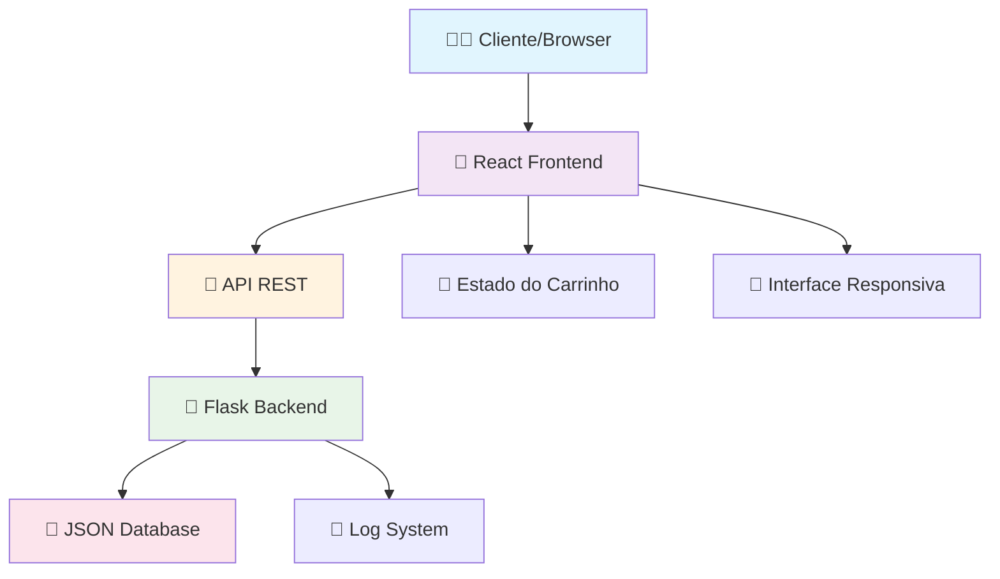

# 🍔 Burger House - Sistema Completo de Pedidos

<div align="center">


**Landing page moderna e funcional para hamburguerias com sistema de pedidos integrado**

[](https://reactjs.org/)
[](https://flask.palletsprojects.com/)
[](https://www.python.org/)
[](https://developer.mozilla.org/en-US/docs/Web/JavaScript)

[](https://choosealicense.com/licenses/mit/)
[](http://makeapullrequest.com)
[](https://github.com/AlexandroGranja/Projeto05-Burger-House/stargazers)

</div>

## 📸 Preview

> **Nota:** Adicione screenshots ou GIF do projeto funcionando aqui


## 🚀 Demo Live

- **🌐 Site:** [Em breve - Deploy no Netlify/Vercel]
- **📱 Mobile:** Totalmente responsivo
- **⚡ API:** Documentação interativa disponível

## ✨ Funcionalidades

<table>
<tr>
<td>

### 🍔 **Frontend (React)**
- ✅ Interface moderna e responsiva
- ✅ Cardápio interativo com filtros
- ✅ Carrinho de compras dinâmico
- ✅ Calculadora de preços em tempo real
- ✅ Formulário de pedidos validado
- ✅ Animações e micro-interações
- ✅ PWA Ready (Progressive Web App)

</td>
<td>

### ⚙️ **Backend (Flask)**
- ✅ API RESTful completa
- ✅ Sistema de pedidos robusto  
- ✅ Persistência de dados JSON
- ✅ Validação de dados server-side
- ✅ CORS configurado
- ✅ Tratamento de erros
- ✅ Documentação automática da API

</td>
</tr>
</table>

## 🏗️ Arquitetura do Sistema



### 🔄 Fluxo de Dados

1. **Frontend React** renderiza interface do usuário
2. **Componente Carrinho** gerencia estado dos pedidos
3. **API REST** comunica com backend Flask
4. **Flask Backend** processa e valida dados
5. **JSON Database** persiste pedidos e cardápio
6. **Resposta** retorna ao frontend com confirmação

## 🛠️ Stack Tecnológica

<details>
<summary><b>📋 Tecnologias Utilizadas</b></summary>

### Frontend
- **React 18.2+** - Biblioteca JavaScript para UI
- **React Hooks** - useState, useEffect, useContext
- **CSS3** - Flexbox, Grid, Animations
- **HTML5** - Estrutura semântica
- **JavaScript ES6+** - Módulos, Arrow Functions, Async/Await

### Backend  
- **Flask 2.3+** - Micro-framework Python
- **Flask-CORS** - Cross-Origin Resource Sharing
- **Python 3.8+** - Linguagem de programação
- **JSON** - Persistência de dados
- **RESTful API** - Arquitetura de serviços

### Ferramentas de Desenvolvimento
- **VS Code** - Editor de código
- **Git** - Controle de versão
- **npm** - Gerenciador de pacotes
- **pip** - Gerenciador de pacotes Python
- **venv** - Ambiente virtual Python

### Deploy & DevOps
- **Docker** - Containerização
- **Heroku/Netlify** - Deploy e hospedagem
- **GitHub Actions** - CI/CD (futuro)

</details>

## 📋 Pré-requisitos

Certifique-se de ter instalado em sua máquina:

| Ferramenta | Versão | Link | Verificar Instalação |
|------------|--------|------|----------------------|
| **Node.js** | 16.0+ | [Download](https://nodejs.org/) | `node --version` |
| **Python** | 3.8+ | [Download](https://www.python.org/) | `python --version` |
| **Git** | 2.0+ | [Download](https://git-scm.com/) | `git --version` |
| **VS Code** | Latest | [Download](https://code.visualstudio.com/) | _Opcional_ |

### ✅ Verificação Rápida
```bash
node --version && npm --version && python --version && git --version
```

## 🚀 Instalação e Configuração

### 1️⃣ **Clonar Repositório**

```bash
# Clone o projeto
git clone https://github.com/AlexandroGranja/Projeto05-Burger-House.git

# Navegue para o diretório
cd Projeto05-Burger-House

# Abra no VS Code (opcional)
code .
```

### 2️⃣ **Configuração do Backend (Flask)**

<details>
<summary><b>🐍 Setup Python/Flask</b></summary>

```bash
# Criar ambiente virtual
python -m venv venv

# Ativar ambiente virtual
# Windows (CMD/PowerShell):
venv\Scripts\activate
# Linux/Mac:
source venv/bin/activate

# Confirmar ativação (deve aparecer (venv) no terminal)
which python  # Linux/Mac
where python   # Windows

# Instalar dependências
pip install --upgrade pip
pip install flask flask-cors python-dotenv

# Se existir requirements.txt:
cd backend
pip install -r requirements.txt
cd ..

# Verificar instalação
python -c "import flask; print(f'Flask {flask.__version__} instalado!')"
```

</details>

### 3️⃣ **Configuração do Frontend (React)**

<details>
<summary><b>⚛️ Setup Node.js/React</b></summary>

```bash
# Instalar dependências do Node.js
npm install

# Se houver problemas de compatibilidade:
npm install --legacy-peer-deps

# Verificar instalação
npm list react

# Limpar cache se necessário:
npm cache clean --force
```

</details>

## ▶️ Executando o Projeto

### 🚀 **Método Rápido (Recomendado)**

```bash
# Terminal 1 - Backend
cd backend
python app.py

# Terminal 2 - Frontend  
npm start
```

### 🔧 **Executação Detalhada**

<details>
<summary><b>🐍 Iniciar Backend Flask</b></summary>

```bash
# Certificar que ambiente virtual está ativo
# Deve aparecer (venv) no início da linha do terminal

# Navegar para backend
cd backend

# Opção 1: Executar diretamente
python app.py

# Opção 2: Usar Flask CLI
export FLASK_APP=app.py  # Linux/Mac
set FLASK_APP=app.py     # Windows
flask run

# Opção 3: Modo desenvolvimento
export FLASK_ENV=development  # Linux/Mac
set FLASK_ENV=development     # Windows
flask run --debug

# Backend estará disponível em: http://localhost:5000
```

</details>

<details>
<summary><b>⚛️ Iniciar Frontend React</b></summary>

```bash
# Certificar que está na pasta raiz (não na pasta backend)
pwd  # deve mostrar: /caminho/para/Projeto05-Burger-House

# Iniciar servidor de desenvolvimento
npm start

# Servidor automático irá abrir o navegador
# Frontend estará disponível em: http://localhost:3000

# Comandos alternativos:
npm run dev     # Se configurado
npm run serve   # Se configurado
```

</details>

## 🌐 Acessos da Aplicação

| Serviço | URL | Descrição |
|---------|-----|-----------|
| 🎨 **Frontend** | http://localhost:3000 | Interface principal da hamburgueria |
| 🔧 **Backend API** | http://localhost:5000 | Servidor Flask e endpoints |
| 📚 **Documentação** | http://localhost:5000/api | Documentação da API |
| 🛒 **Pedidos** | http://localhost:5000/orders | Endpoint de pedidos |

## 📁 Estrutura do Projeto

```bash
Projeto05-Burger-House/
├── 📁 backend/                 # 🐍 Servidor Flask
│   ├── app.py                 # Aplicação principal Flask
│   ├── requirements.txt       # Dependências Python
│   ├── models/               # Modelos de dados
│   ├── routes/               # Rotas da API
│   ├── utils/                # Utilitários
│   └── data/                 # Arquivos JSON
├── 📁 frontend/              # ⚛️ Aplicação React  
│   ├── public/               # Arquivos estáticos
│   ├── src/                  # Código fonte React
│   │   ├── components/       # Componentes reutilizáveis
│   │   ├── pages/           # Páginas da aplicação
│   │   ├── styles/          # Arquivos CSS
│   │   ├── utils/           # Funções auxiliares
│   │   ├── hooks/           # React Hooks customizados
│   │   └── App.js           # Componente raiz
│   ├── package.json         # Dependências e scripts npm
│   └── package-lock.json    # Lock das dependências
├── 📁 docs/                  # 📚 Documentação
├── 📁 assets/               # 🖼️ Imagens e recursos
├── .dockerignore            # Configuração Docker
├── .gitignore              # Arquivos ignorados pelo Git
├── Dockerfile              # Container Docker
├── Procfile               # Deploy Heroku
├── start.sh               # Script de inicialização
└── README.md              # Este arquivo
```

## 🔧 Comandos Úteis

<details>
<summary><b>⚛️ Frontend (React/Node.js)</b></summary>

```bash
npm start              # Servidor desenvolvimento (localhost:3000)
npm run build          # Build de produção 
npm test               # Executar testes
npm run eject          # Ejetar configuração (irreversível!)
npm install <pacote>   # Instalar nova dependência
npm uninstall <pacote> # Remover dependência
npm audit fix          # Corrigir vulnerabilidades
npm outdated          # Verificar pacotes desatualizados
```

</details>

<details>
<summary><b>🐍 Backend (Flask/Python)</b></summary>

```bash
python app.py          # Iniciar servidor Flask
flask run              # Alternativa Flask CLI
flask run --debug      # Modo debug ativo
pip freeze             # Listar dependências instaladas  
pip install <pacote>   # Instalar nova dependência
pip uninstall <pacote> # Remover dependência
pip freeze > requirements.txt  # Salvar dependências
pip list --outdated    # Verificar pacotes desatualizados
```

</details>

<details>
<summary><b>🐳 Ambiente Virtual Python</b></summary>

```bash
# Criar ambiente virtual
python -m venv venv

# Ativar ambiente virtual
source venv/bin/activate   # Linux/Mac
venv\Scripts\activate      # Windows CMD
venv\Scripts\Activate.ps1  # Windows PowerShell

# Desativar ambiente virtual
deactivate

# Remover ambiente virtual (se necessário)
rm -rf venv              # Linux/Mac  
rmdir /s venv           # Windows CMD
Remove-Item -Recurse -Force venv  # Windows PowerShell
```

</details>

## 🔧 Solução de Problemas Comuns

<details>
<summary><b>❌ Frontend com tela em branco</b></summary>

**Problema:** Tela branca no navegador
**Soluções:**

```bash
# 1. Limpar cache e reinstalar
rm -rf node_modules package-lock.json  # Linux/Mac
rmdir /s node_modules && del package-lock.json  # Windows
npm install
npm start

# 2. Verificar console do navegador (F12)
# 3. Verificar se porta 3000 está livre
netstat -an | grep :3000  # Linux/Mac
netstat -an | findstr :3000  # Windows

# 4. Iniciar em porta diferente
npm start -- --port 3001
```

</details>

<details>
<summary><b>❌ Erro "Flask application not found"</b></summary>

**Problema:** Flask não encontra aplicação
**Soluções:**

```bash
# 1. Verificar se está na pasta backend
cd backend
ls app.py  # deve existir

# 2. Verificar ambiente virtual ativo
which python  # deve apontar para venv

# 3. Definir variável FLASK_APP
export FLASK_APP=app.py  # Linux/Mac
set FLASK_APP=app.py     # Windows

# 4. Executar diretamente
python app.py
```

</details>

<details>
<summary><b>❌ Erro de CORS</b></summary>

**Problema:** Blocked by CORS policy
**Soluções:**

```bash
# 1. Instalar flask-cors
pip install flask-cors

# 2. Verificar configuração no app.py:
# from flask_cors import CORS
# CORS(app)

# 3. Verificar URLs do frontend/backend
# Frontend: http://localhost:3000
# Backend:  http://localhost:5000
```

</details>

<details>
<summary><b>❌ Porta já está em uso</b></summary>

**Problema:** Port already in use
**Soluções:**

```bash
# Ver processos usando as portas
lsof -i :3000  # Linux/Mac
lsof -i :5000  # Linux/Mac
netstat -ano | findstr :3000  # Windows
netstat -ano | findstr :5000  # Windows

# Matar processo se necessário
kill -9 <PID>  # Linux/Mac
taskkill /PID <PID> /F  # Windows

# Usar portas alternativas
npm start -- --port 3001    # Frontend
flask run --port 5001       # Backend
```

</details>

<details>
<summary><b>❌ Problemas com Ambiente Virtual</b></summary>

**Problema:** Virtual environment issues
**Soluções:**

```bash
# 1. Recriar ambiente virtual
deactivate  # se estiver ativo
rm -rf venv  # Linux/Mac
rmdir /s venv  # Windows

python -m venv venv
source venv/bin/activate  # Linux/Mac
venv\Scripts\activate     # Windows

# 2. Reinstalar dependências
pip install --upgrade pip
pip install flask flask-cors python-dotenv

# 3. Verificar versão Python
python --version  # deve ser 3.8+
```

</details>

## 🔒 Extensões Recomendadas (VS Code)

### 🛠️ **Essenciais para o Projeto**

```json
{
  "recommendations": [
    "ms-python.python",
    "ms-python.pylance", 
    "bradlc.vscode-tailwindcss",
    "esbenp.prettier-vscode",
    "ms-vscode.vscode-json",
    "formulahendry.auto-rename-tag",
    "christian-kohler.path-intellisense",
    "eamodio.gitlens",
    "ms-vscode-remote.remote-containers"
  ]
}
```

### 📦 **Lista Completa de Extensões**

- **ES7+ React/Redux/React-Native snippets** - Snippets React
- **Python** (Microsoft) - Suporte completo Python
- **Pylance** - IntelliSense Python avançado
- **Auto Rename Tag** - Renomear tags HTML automaticamente
- **Bracket Pair Colorizer 2** - Colorir parênteses  
- **GitLens** - Git supercharged
- **Live Server** - Servidor local para desenvolvimento
- **Prettier** - Formatador de código
- **Path Intellisense** - Autocomplete para caminhos
- **Thunder Client** - Cliente REST integrado

## 🐳 Docker (Opcional)

<details>
<summary><b>🚢 Executar com Docker</b></summary>

```bash
# Build da imagem
docker build -t burger-house .

# Executar container
docker run -p 3000:3000 -p 5000:5000 burger-house

# Docker Compose (se disponível)
docker-compose up --build

# Parar containers
docker-compose down
```

</details>

## 🚀 Deploy e Produção

<details>
<summary><b>☁️ Opções de Deploy</b></summary>

### Frontend (React)
- **Netlify** - Deploy automático via Git
- **Vercel** - Otimizado para React
- **GitHub Pages** - Gratuito para projetos públicos
- **Surge.sh** - Deploy rápido via CLI

### Backend (Flask)  
- **Heroku** - Platform as a Service
- **Railway** - Deploy moderno e simples
- **PythonAnywhere** - Especializado em Python
- **DigitalOcean** - VPS com controle total

### Banco de Dados
- **MongoDB Atlas** - NoSQL na nuvem
- **PostgreSQL** (Heroku/Railway) - SQL robusto
- **Firebase** - Backend as a Service

</details>

## 📈 Roadmap e Melhorias Futuras

### 🔄 **Versão 2.0**
- [ ] 🗄️ Integração com banco de dados real (MongoDB/PostgreSQL)
- [ ] 🔐 Sistema de autenticação de usuários
- [ ] 💳 Integração com gateway de pagamento (Stripe/PayPal)
- [ ] 📱 App mobile (React Native)
- [ ] 🔔 Notificações push
- [ ] 📊 Dashboard administrativo

### 🎨 **Melhorias UI/UX**
- [ ] 🌙 Modo escuro/claro
- [ ] 🎭 Temas personalizáveis
- [ ] ⚡ Lazy loading de imagens
- [ ] 🔄 Estados de loading aprimorados
- [ ] 📱 Progressive Web App (PWA)
- [ ] 🎬 Animações com Framer Motion

### 🧪 **Qualidade e Testes**
- [ ] ✅ Testes unitários (Jest/Pytest)
- [ ] 🔄 CI/CD com GitHub Actions
- [ ] 📊 Análise de código (SonarQube)
- [ ] 🛡️ Testes de segurança
- [ ] 📈 Monitoramento de performance

## 🤝 Como Contribuir

Contribuições são sempre bem-vindas! Veja como você pode ajudar:

### 🔧 **Reportar Bugs**
1. Verifique se o bug já foi reportado nas [Issues](https://github.com/AlexandroGranja/Projeto05-Burger-House/issues)
2. Abra uma nova issue com template de bug
3. Inclua screenshots, logs de erro e passos para reproduzir

### ✨ **Sugerir Melhorias** 
1. Abra uma issue com template de feature request
2. Descreva detalhadamente a funcionalidade
3. Explique o valor que ela agregaria ao projeto

### 💻 **Contribuir com Código**
```bash
# 1. Fork do projeto
# 2. Criar branch para sua feature
git checkout -b feature/MinhaNovaFeature

# 3. Commit das mudanças
git commit -m 'feat: Adiciona nova funcionalidade incrível'

# 4. Push para a branch
git push origin feature/MinhaNovaFeature

# 5. Abrir Pull Request
```

### 📋 **Padrões de Commit**
```bash
feat: nova funcionalidade
fix: correção de bug  
docs: alterações na documentação
style: formatação, ponto e vírgula, etc
refactor: refatoração de código
test: adicionando testes
chore: atualização de ferramentas, configs, etc
```

## 📄 Licença

Este projeto está licenciado sob a **MIT License** - veja o arquivo [LICENSE](LICENSE) para detalhes.

### 📋 **Resumo da Licença MIT:**
- ✅ Uso comercial permitido
- ✅ Modificação permitida  
- ✅ Distribuição permitida
- ✅ Uso privado permitido
- ❌ Responsabilidade limitada
- ❌ Sem garantias

## 👨‍💻 Autor

<div align="center">

### **Alexandro Granja**

[](https://github.com/AlexandroGranja)
[](https://linkedin.com/in/alexandro-granja)
[](mailto:seu-email@exemplo.com)

*Desenvolvedor Full Stack apaixonado por criar soluções inovadoras*

</div>

## 🆘 Precisa de Ajuda?

<div align="center">

### 💬 **Suporte e Comunidade**

[](https://github.com/AlexandroGranja/Projeto05-Burger-House/issues)
[](https://github.com/AlexandroGranja/Projeto05-Burger-House/discussions)

</div>

### 🔍 **Checklist de Problemas Comuns**

- [ ] ✅ Todos os pré-requisitos instalados?
- [ ] 📁 Está na pasta correta ao executar comandos?
- [ ] 🔌 Portas 3000 e 5000 estão livres?
- [ ] 🐍 Ambiente virtual Python está ativo?
- [ ] 🌐 Frontend e backend estão rodando simultaneamente?
- [ ] 🔧 Dependências foram instaladas corretamente?

### 📚 **Recursos Úteis**

- [📖 Documentação do React](https://reactjs.org/docs)
- [🐍 Documentação do Flask](https://flask.palletsprojects.com/)
- [📘 Guia do Git](https://git-scm.com/documentation)
- [💻 VS Code Tips](https://code.visualstudio.com/docs)

---

<div align="center">

### 🍔✨ **Happy Coding!** ✨🍔

**Se este projeto foi útil, considere dar uma ⭐ no repositório!**

[](#-burger-house---sistema-completo-de-pedidos)

</div>
